# Prediction Market Interoperability Harness

An AI-native research system for finding, testing, and retaining semantic
arbitrage hypotheses across prediction markets.

The project treats a prediction-market quote as a **traded valuation of a
venue-defined settlement contract**—not as a certified probability of the
world. Agents explore the large, ambiguous space of possible relationships;
first-party code preserves the evidence, checks exact payout logic with
`bigint`, and decides whether a hypothesis is admissible for simulation.

> **Status: pre-alpha research harness.** Anonymous catalog and market-data
> research, deterministic replay, simulation, and shadow observation are in
> scope. Live orders, transaction signing, token approvals, credentials for
> production trading, and movement of funds are disabled and out of scope.

## Why this exists

The interesting opportunities are rarely identical strings on two venues.
They can be relationships such as:

- two differently worded contracts settling on the same world event;
- one event implying, inhibiting, or partially excluding another;
- several contracts forming a partition only under explicit premises;
- venues observing the same world through different rules, windows, or
  oracles;
- a semantically plausible relation whose market prices leave enough failure
  budget to justify deeper research.

Those relationships are too open-ended for one fixed query or claim schema.
The harness therefore uses long-running Agents to search heuristically, while
keeping semantic judgment, economic qualification, and execution authority as
separate, inspectable boundaries.

## The system in one view

```mermaid
flowchart LR
  A["Anonymous venue evidence"] --> B["Content-addressed market corpus"]
  B --> C["Agent exploration and ontology experiments"]
  C --> D["Durable hypotheses and counterexamples"]
  D --> E["Independent semantic review"]
  E --> F["Deterministic payoff compilation"]
  F --> G["Fresh bigint market simulation"]
  G --> H["Exact verifier"]
  H --> I["Shadow-only observation"]

  C -. "proposes" .-> D
  E -. "cannot certify" .-> H
  H -. "cannot enable live trading" .-> I
```



The core ontological split is:

1. **World proposition** — what may happen in reality.
2. **Settlement contract** — how one venue maps evidence about the world to an
   outcome.
3. **Traded state** — the current book and its valuation of that contingent
   payout.

See [Concepts](docs/CONCEPTS.md) for the reasoning model and
[Architecture](docs/ARCHITECTURE.md) for the implementation boundaries.

## What works today

- Anonymous catalog observation for seven venue families, with raw response
  hashes, receive times, protocol identities, and bounded SQLite retention.
- A durable AI research control plane with heuristic search, ontology
  directories, exact tool effects, campaigns, retries, token attribution, and
  operator notifications.
- Selectable Agent runtime, credential binding, model, and model-specific
  reasoning effort. Codex OAuth with `gpt-5.6-terra` / high effort is the
  default; Pi and DeepSeek-backed profiles remain available for qualified
  workloads.
- Deterministic order-book replay, chaos qualification, conservative depth and
  fee treatment, and exact fixed-point portfolio arithmetic.
- Independent semantic review, payoff compilation, certificate verification,
  capital accounting, risk gates, and certificate-bound shadow replay.
- Harmony Studio: a React + Vite + shadcn/ui operator surface over the Node
  control plane and its SSE projections.
- Fixture-backed adapters for Polymarket Global, Polymarket US, Kalshi,
  Gemini Prediction Markets, Opinion, Myriad, and Limitless.

The detailed capability map lives in [Architecture](docs/ARCHITECTURE.md),
[Studio](docs/STUDIO.md), and the current [plan index](PLANS.md).

## Quick start

Requirements: Node.js 24+ and pnpm 11.

```bash
corepack enable
pnpm install
pnpm check
pnpm test
pnpm studio
```

`pnpm studio` starts both processes:

- control plane: `http://127.0.0.1:4100`
- Studio: Vite starts at `http://127.0.0.1:5173` and automatically advances to
  `5174`, `5175`, and later ports when a port is occupied

The default operational database is `.data/control-plane.sqlite` in WAL mode.
It is ignored by Git. The UI remains useful without a DeepSeek key because the
default Codex route uses the local Codex OAuth session; model availability is
reported explicitly rather than silently falling back.

For environment settings, persistent scheduling, provider selection, and
smoke commands, read [Operations](docs/OPERATIONS.md).

## First use

1. Open Studio and check **Readiness** for the control plane, catalog, storage,
   Agent runtime, and credential posture.
2. Refresh anonymous catalogs. A refresh creates a new immutable corpus; it
   does not spend model budget or grant trading authority.
3. Open the ontology / discovery workspace and inspect the standing campaigns.
   Run a bounded campaign or issue against the retained corpus.
4. Read the effect timeline, exact listing references, counterexamples, and
   token usage. An empty or falsified run is retained research evidence.
5. Move only a grounded multi-listing hypothesis into independent review.
6. Treat economic hints as routing signals until fresh books, fees, depth, and
   the exact verifier all agree.

The longer operator walkthrough is in [Studio](docs/STUDIO.md).

## Non-negotiable safety properties

- Money, prices, quantities, fees, payouts, PnL, and ticks use `bigint`
  fixed-point values—never JavaScript `number`.
- Unknown precision, incomplete payout partitions, stale or gapped books, and
  mismatched evidence fail closed.
- Agents and solvers propose; only first-party review/verification boundaries
  can promote or certify.
- Venue SDK and generated API types stay inside their adapter packages.
- No current gateway has the authority or credentials to place a live order.
- Every public evidence artifact is bound to source, receive time, protocol
  identity, and content hash.

## Documentation

Start at the [documentation index](docs/README.md).

| If you want to… | Read |
| --- | --- |
| understand the product thesis | [Concepts](docs/CONCEPTS.md) |
| run or configure the system | [Operations](docs/OPERATIONS.md) |
| use the dashboard | [Studio](docs/STUDIO.md) |
| understand authority and data flow | [Architecture](docs/ARCHITECTURE.md) |
| inspect machine-readable commands | [CLI](docs/CLI.md) |
| see the current research direction | [Plans](PLANS.md) |
| answer deferred operator decisions | [Questions](QUESTIONS.md) |

## Repository map

- `apps/studio` — non-value-moving operator cockpit.
- `packages/control-plane` — durable orchestration, projections, Agent tools,
  campaigns, and SQLite state.
- `packages/domain`, `protocol`, `evidence`, `market-state` — canonical contract,
  transport, evidence, and deterministic-book foundations.
- `packages/opportunity`, `capital`, `risk`, `execution`, `liquidity` — exact
  qualification and shadow-only lifecycle.
- `packages/venue-*` — venue-local codecs, manifests, and adapters.
- `projects/fixtures` — small immutable protocol evidence.
- `projects/campaigns` — content-addressed qualification artifacts.
- `projects/venue-research` — dated official-source research.
- `docs/design` — focused design truth.
- `plans` — retained execution and mutation evidence; [PLANS.md](PLANS.md) is
  the current index.

The original design brief remains in
[prediction-market-harness-design-and-codex-prompt.md](prediction-market-harness-design-and-codex-prompt.md).
Current implementation truth belongs in `docs/`, code, tests, and retained
campaign evidence.
