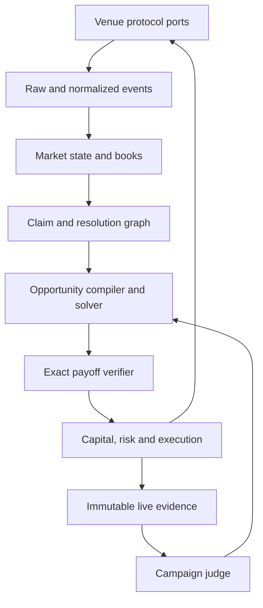

# Prediction Market Interoperability Harness

> 系统选型、架构设计与 Codex 开工 Prompt  
> Status: proposed / pre-alpha  
> Date: 2026-07-31

## 0. 执行摘要

这个项目不是一个单所交易 Bot，也不是另一个通用量化框架。它是一套面向预测市场的跨所互操作、套利证明、执行、资本管理与流动性提供 Harness。

第一阶段以“预测市场之间的套利”为主线，同时从第一天保留对长尾小所、新所和不同市场机制的支持。大所提供价格发现、深度和对冲出口；小所与新所提供价格偏差、做市需求和新增流动性入口。未来的“预测市场与现实锚定物套利”应当可以通过新增 Instrument 类型进入同一 Claim / Outcome / Payout 体系，而不重写 Core。

核心原则：

1. **宽实现、窄权限**：第一轮即研究和接入多种真实 venue，用异质性建立抽象；真实资金权限逐个 venue 晋升，默认关闭。
2. **Claim 优先于 Market**：世界命题、判定规则、结果空间和交易所合约必须分层。
3. **套利必须可证明**：Solver 只能提出候选；第一方 exact verifier 才能发布证书。
4. **外部 SDK 是协议 codec，不是系统上游**：SDK 类型不得进入 Core。
5. **第一方 Harness**：不采用 NautilusTrader、Hummingbot 或其他通用交易框架。
6. **策略可变，宪法固定**：Agent 可以写 scanner、solver proposal 和 maker controller；不能修改 resolution authority、exact verifier、risk governor、execution authority。
7. **原始事实与规范事实并存**：每个 venue payload 必须保留原文、接收时间和 hash；normalized model 不得覆盖原始证据。
8. **Pre-alpha 不维护错误兼容性**：抽象改善时直接迁移 fixtures、adapters、tests 和 docs，删除旧模型。

推荐技术栈：

| 层 | 选择 |
| --- | --- |
| 主语言 | TypeScript，`strict: true` |
| 生产运行时 | Node.js 24+ |
| Monorepo | pnpm workspace |
| Schema | Zod；外部生成类型只存在于 adapter 内 |
| 数值 | `bigint` fixed-point；Core 禁止 JS `number` 表示钱、价格、数量、费用和 payout |
| 测试 | Vitest + fast-check；模型测试、property test、fixture replay |
| Operational state | SQLite WAL，单机优先 |
| Dense evidence | 分段 NDJSON / Parquet，content-addressed manifests |
| 离线优化 | Python 3.12 + HiGHS，仅作 solver sidecar |
| Studio | React/Vite，读取 Core projection，不成为第二个 evaluator |
| Rust | 暂不采用；只有 profiling 证明 TypeScript 执行内核不足时再抽取 |

## 1. 产品本体

系统的长期产品形态是 Prediction Market Liquidity Network：

```text
大所：价格发现、主要深度、对冲出口
小所：套利来源、basis 来源、做市目标
新所：最快接入、最早定价、潜在流动性客户
现实锚定物：未来的外部概率与价格约束
```

第一批执行程序：

- Cross-venue exact arbitrage
- Multi-outcome / complete-set arbitrage
- Resolution-aware basis trading
- Cross-venue hedge curve
- Illiquid-venue market making

非目标：

- 不做通用证券交易引擎。
- 不做面向任意资产类别的 Strategy SDK。
- 不以聊天、LLM 预测概率或新闻总结作为第一阶段本体。
- 不在第一轮取得或使用真实账户凭证。
- 不把“标题相似”当作合约等价。
- 不用浮点 PnL 冒充套利证明。
- 不把 live mark-to-market 当作最终结算真相。

## 2. 初始 Venue Census

以下是开工时必须重新通过官方文档核验的候选，不是永久冻结列表：

| Venue / family | 当前可见特征 | 首轮目标 |
| --- | --- | --- |
| Polymarket Predictions | Gamma、CLOB、Data、Relayer、WebSocket、CTF、split/merge/redeem、Combo/RFQ；官方 TS SDK | Catalog + realtime + raw capture + shadow execution |
| Polymarket US | 独立 API 和账户/合约语义 | 独立 adapter，禁止与全球版合并 |
| Kalshi | REST、WebSocket、FIX、OpenAPI/AsyncAPI、demo、binary/multivariate、fixed-point | Catalog + realtime + demo execution |
| Gemini Prediction Markets | 新的 REST/WebSocket event-contract surface | Research + fixtures + catalog adapter |
| Opinion | Prediction-market OpenAPI | Research + fixtures + catalog/realtime 能力 |
| Predict.fun | Beta REST、WebSocket、order/position endpoints | Research + fixtures + read adapter |
| Limitless | Base 上的预测市场、链上和 API surface | Research + on-chain/API boundary |
| Myriad | 多链 prediction-market protocol / application | Research + protocol/market fixtures |

Phase 0 必须补充：

- 其他仍在运营且有可审计 API、合约或公开盘口的 venue；
- 地区限制和账户可用性；
- 交易、做市、结算、提现、取消、API key、WebSocket 和 sandbox/demo 能力；
- 市场机制：CLOB、AMM、RFQ、tokenized outcomes、centralized contracts；
- 精度、tick、quantity、fee、rebate、collateral、settlement 和 void 规则；
- 官方 SDK、OpenAPI/AsyncAPI、合约 ABI 和 changelog 的更新频率。

设计必须由至少以下六类真实 fixture 共同约束：

1. 链上 outcome-token CLOB；
2. 中心化 binary event contract；
3. AMM 型市场；
4. 原生 multi-outcome / scalar / range 市场；
5. Combo / RFQ / multivariate 市场；
6. 流动性较差但 API 或合约开放的新 venue。

“支持所有 venue”不意味着所有 venue 同时获得真实资金权限。数据覆盖可以宽；交易资格必须逐个证明。

## 3. 核心领域模型

### 3.1 四层分离

```text
Claim
→ Resolution Specification
→ Outcome Space
→ Venue Listing / Instrument
```

#### Claim

对世界命题的规范化身份，不含交易所价格和账户信息。

```ts
type Claim = {
  id: ClaimId
  title: string
  description: string
  domain: string
  resolutionSpecId: ResolutionSpecId
  outcomeSpaceId: OutcomeSpaceId
}
```

#### Resolution Specification

必须保留：

- resolution authority / source；
- open、close、observation、resolution 时间；
- 时区；
- void、cancel、invalid、ambiguous 条款；
- correction / appeal / dispute 行为；
- 原始规则文本及 hash；
- 获取时间和来源；
- 规则版本。

#### Outcome Space

不能只支持 YES/NO。需要表达：

- binary；
- exhaustive categorical；
- non-exhaustive categorical；
- scalar/range；
- conditional；
- multivariate；
- invalid/void/canceled states。

#### Instrument / Listing

某个 venue 上可交易的合约，其核心是 payout function：

```ts
type PayoutFunction = (
  resolution: CanonicalResolutionState
) => ReadonlyMap<CollateralId, Fixed>
```

二元合约只是 payout algebra 的简单实例。

### 3.2 Market Link 与等价等级

```ts
type EquivalenceGrade =
  | "EXACT"
  | "CONDITIONAL"
  | "RELATED"
  | "CONFLICTING"
  | "UNREVIEWED"
```

- `EXACT`：完整 resolution state 下 payout 可证明一致。
- `CONDITIONAL`：在显式假设下等价。
- `RELATED`：有关联，可参与定价或统计模型，但不是套利证明。
- `CONFLICTING`：已发现截止时间、resolution、void 或 payout 冲突。
- `UNREVIEWED`：Agent 提出的候选关系。

Matcher Agent 可以提出关系和差异摘要，但不能自行晋升为 `EXACT`。晋升必须由独立 reviewer authority 发布 hash-bound decision。

### 3.3 数值纪律

Core 禁止使用 JS `number` 表示：

- price；
- size；
- quantity；
- collateral；
- fee；
- rebate；
- payout；
- PnL；
- tick；
- probability used as contract value。

统一表示：

```ts
type Fixed = bigint
type Scale = bigint
```

首版内部可统一为 `1e-8` 或基于 instrument 显式 scale。Adapter 对外部 decimal string 做严格转换；转换必须拒绝非有限值、超精度值和隐式 rounding。

时间同时记录：

- venue timestamp；
- monotonic receive timestamp；
- wall-clock receive timestamp；
- local processing timestamp；
- clock offset / uncertainty。

## 4. 架构总览



系统有两个循环：

### 快循环

```text
book update
→ opportunity candidate
→ exact certificate
→ risk decision
→ execution
→ fill/reconcile
→ market state
```

### 慢循环

```text
strategy revision
→ replay/shadow/canary campaign
→ immutable evidence
→ promote/revise/retire
```

未解决事件的 mark-to-market 只属于临时证据。最终 settlement、withdrawability 和 capital recovery 必须进入慢循环。

## 5. Venue Protocol Ports

不要实现一个带几十个 optional 字段的万能 `VenueAdapter`。每个 venue 组合若干能力：

```ts
interface MarketCatalogPort {}
interface ContractRulesPort {}
interface RealtimeBookPort {}
interface TradeTapePort {}
interface OrderGatewayPort {}
interface PositionGatewayPort {}
interface BalanceGatewayPort {}
interface SettlementGatewayPort {}
interface ConditionalTokenPort {}
interface LiquidityProvisionPort {}
interface ComboRfqPort {}
interface AmmPoolPort {}
```

每个 adapter 发布：

- capability manifest；
- protocol/version identity；
- official documentation sources；
- fixture corpus；
- precision and rounding rules；
- authentication/signing boundary；
- operational limitations；
- qualification state。

第三方 SDK 只能存在于 `venue-*` package 内。Adapter 必须把 SDK response 转成第一方 schema，同时保存 raw bytes/hash。SDK 发版、失效或替换不得改变 Core 类型。

### 5.1 Venue Qualification

```text
DISCOVER
→ OBSERVE
→ PRICE
→ EXECUTE
→ HEDGE
→ MAKE
→ SETTLE
```

- `DISCOVER`：能发现市场和规则。
- `OBSERVE`：能维护可信 market state。
- `PRICE`：允许参与定价和机会发现。
- `EXECUTE`：真实订单状态机已通过 canary。
- `HEDGE`：可作为可靠对冲出口。
- `MAKE`：撤单、库存和 heartbeat 足以安全做市。
- `SETTLE`：真实结算、赎回、提现和资金恢复已被证明。

状态不是单一 boolean；一个 venue 可以 `PRICE` 但不能 `EXECUTE`，可以 `EXECUTE` 但尚未 `SETTLE`。

## 6. Market Data 与 Book State

每个 normalized event 必须包含：

```ts
type EventEnvelope<T> = {
  venue: VenueId
  protocolVersion: string
  instrumentId?: InstrumentId
  venueSequence?: string
  venueTimestamp?: Instant
  receivedAt: Instant
  monotonicReceivedNs: bigint
  rawHash: Hash
  payload: T
}
```

Order book 生命周期：

```text
EMPTY
→ SNAPSHOT_VALID
→ APPLYING_DELTAS
→ STALE
→ GAP_DETECTED
→ REBUILDING
→ SNAPSHOT_VALID
```

规则：

- sequence gap、未知 delta、tick change、市场暂停、重连、clock uncertainty 超限时 fail closed；
- book generation 变化使旧 certificate 失效；
- snapshot/delta 必须可 deterministic replay；
- 从第一天开始录制 raw stream，不依赖未来能补历史盘口；
- dense stream 分段存储，manifest 保留范围、hash、schema、source 和缺口。

## 7. 套利编译与证明

### 7.1 Opportunity 不是 Pair

套利对象是一个跨 listing 的有容量 hypergraph，不是 `MarketPair`：

```text
Claim graph
→ compatible instruments
→ canonical resolution partition
→ bounded trade variables
→ portfolio payoff
```

每个盘口档位是有上限的变量 \(x_i\)。求最大最差结果 \(m\)：

\[
\sum_i x_i \cdot payout_{i,\omega}
- \sum_i cost_i(x_i)
\ge m,\quad \forall \omega
\]

同时约束：

- depth；
- fee/rebate；
- collateral balance；
- quantity/tick precision；
- max venue exposure；
- borrow/mint/split/merge availability；
- settlement currency；
- capital lock；
- execution sequence；
- per-leg residual risk。

初期简单 complete-set 可以由 TypeScript 直接枚举。复杂 LP/MILP 可调用 Python/HiGHS sidecar，但 sidecar 只返回 candidate solution。

### 7.2 Exact Certificate

Solver 输出必须由 TypeScript `bigint` verifier 重算：

```ts
type ArbitrageCertificate = {
  id: CertificateId
  claimGraphHash: Hash
  resolutionPartitionHash: Hash
  listingRuleHashes: Hash[]
  bookGenerationHashes: Hash[]
  feeScheduleHashes: Hash[]
  legs: ExecutableLeg[]
  payoffByResolution: Record<ResolutionStateId, Fixed>
  worstCaseGross: Fixed
  worstCaseAfterFees: Fixed
  capitalRequiredByVenue: Record<VenueId, Fixed>
  venueAssumptions: VenueRiskAssumption[]
  expiresAt: Instant
}
```

分类必须诚实：

- `CERTIFIED_CONTRACT_ARBITRAGE`
- `VENUE_BOUNDED_ARBITRAGE`
- `CONDITIONAL_BASIS`
- `SEMANTIC_SPREAD`
- `MARKET_MAKING`

只有完整 payout 与 fee 证明成立的机会可以使用 `ARBITRAGE`。Venue/counterparty、withdrawal、void 和 settlement 风险必须单列。

## 8. Capital、Risk 与 Execution

### 8.1 资本是分割的

每个 venue 单独维护：

- available collateral；
- open-order reservation；
- filled inventory；
- hedgeable inventory；
- merge/redeem inventory；
- unresolved locked capital；
- withdrawal state；
- settlement receivable；
- transfer delay and failure evidence。

机会排序不能只看 nominal spread，应看：

\[
\frac{\text{worst-case net profit}}
{\text{capital at risk}\times\text{expected lock time}}
\]

### 8.2 Execution DAG

执行计划从第一天支持多腿和替代路径：

```ts
type ExecutionPlan = {
  certificateId: CertificateId
  intents: OrderIntent[]
  dependencies: ExecutionDependency[]
  hedgeCheckpoints: HedgeCheckpoint[]
  abortPolicies: AbortPolicy[]
  residualRiskByCheckpoint: RiskEnvelope[]
}
```

状态机至少覆盖：

```text
PLANNED
→ RESERVED
→ SUBMITTING
→ ACKNOWLEDGED
→ PARTIALLY_HEDGED
→ LOCKED
→ UNWINDING
→ SETTLED / FAILED / UNKNOWN
```

订单状态：

```text
INTENT
→ SUBMITTING
→ ACKNOWLEDGED
→ PARTIAL
→ FILLED / CANCELED / REJECTED / UNKNOWN
```

`UNKNOWN` 必须触发 reconcile，不能盲目重试。能使用 client order id 或签名订单 identity 时必须幂等。

Risk Governor 固定权限：

- stale/gapped book 禁止开仓；
- expired certificate 禁止开仓；
- max residual leg exposure；
- max venue capital；
- max unresolved capital；
- max cancel latency；
- disconnect / heartbeat kill；
- local/venue state divergence kill；
- no live execution by default；
- Agent 不得修改 live authority。

## 9. Market Making

做市是套利与对冲 Core 的第二个执行程序，不另建世界模型。

系统从其他 venue 的可执行深度生成 `HedgeCurve`：

```ts
type HedgeCurve = {
  claimId: ClaimId
  side: OutcomeSide
  asOf: Instant
  points: Array<{
    quantity: Fixed
    allInCost: Fixed
    hedgeLegs: HedgeLeg[]
    basisRisk: Fixed
  }>
}
```

低流动性 venue 的报价 spread 至少覆盖：

\[
hedge\ cost
+ fees
+ execution\ risk
+ resolution\ mismatch
+ venue\ risk
+ capital\ lock
+ inventory\ premium
\]

报价不能仅锚定其他市场 midpoint，而必须锚定真实可执行 hedge frontier。Quote size 不得超过可用对冲深度与风险预算。

做市 campaign 必须衡量：

- spread capture；
- adverse selection；
- fill rate；
- cancel latency；
- inventory；
- hedge slippage；
- venue fee/rebate/reward；
- capital-time return；
- terminal resolution exposure；
- settlement and withdrawal success。

## 10. Evidence 与存储

### 10.1 文件与数据库边界

Git / project files 拥有：

- Claim；
- ResolutionSpec；
- OutcomeSpace；
- reviewed MarketLink；
- strategy source；
- campaign definitions；
- risk policy；
- design docs；
- small immutable fixtures；
- evidence manifests。

SQLite WAL 拥有：

- operational order/fill/position state；
- adapter checkpoints；
- idempotency records；
- current qualification state；
- live supervisor state。

NDJSON / Parquet segments 拥有：

- raw market streams；
- normalized dense events；
- replay datasets；
- large campaign traces。

不可把数 GB dense evidence 永久直接堆入 Git。Git 保留 content hash、source、schema、time range、gap audit 和可复现 locator。

### 10.2 Evidence Identity

每个 campaign 必须绑定：

- source commit；
- dirty state；
- Node/Python/runtime version；
- adapter versions；
- official protocol/API versions；
- strategy hash；
- claim/resolution/listing hashes；
- fee/capability/qualification state；
- dataset/stream manifests；
- risk policy；
- live authority；
- exact start/end time；
- every order/fill/reconcile/kill/settlement event。

## 11. Agent-native Workbench

### 11.1 Agent 可编辑范围

允许：

- venue research；
- raw fixture acquisition；
- adapter implementation；
- match proposal；
- opportunity scanners；
- solver proposal；
- maker controller；
- Studio projection；
- documentation and tests。

受保护：

- reviewed equivalence decisions；
- exact payoff verifier；
- Risk Governor；
- credential store；
- live authority；
- execution identity；
- evidence immutability；
- campaign Judge。

### 11.2 CLI

建议从一开始提供 versioned JSON envelope：

```text
pmh venue research
pmh venue inspect
pmh venue qualify
pmh market discover
pmh market record
pmh claim inspect
pmh claim match
pmh link review
pmh opportunity scan
pmh opportunity verify
pmh execution plan
pmh execution shadow
pmh execution reconcile
pmh campaign run
pmh campaign inspect
pmh studio
```

每个命令返回：

- exact identity；
- current state；
- diagnostics；
- operation effects；
- artifacts；
- allowed next actions。

Studio 只读取 Core projection，不重算套利、PnL、资格或 verdict。

## 12. 推荐 Monorepo

```text
prediction-market-harness/
├── AGENTS.md
├── PLANS.md
├── package.json
├── pnpm-workspace.yaml
├── tsconfig.base.json
├── packages/
│   ├── domain/
│   ├── protocol/
│   ├── contract-graph/
│   ├── payoff/
│   ├── market-state/
│   ├── opportunity/
│   ├── execution/
│   ├── risk/
│   ├── capital/
│   ├── evidence/
│   ├── venue-polymarket/
│   ├── venue-polymarket-us/
│   ├── venue-kalshi/
│   ├── venue-gemini/
│   ├── venue-opinion/
│   ├── venue-predict-fun/
│   ├── venue-limitless/
│   ├── venue-myriad/
│   ├── cli/
│   └── studio/
├── labs/
│   └── solver-python/
├── projects/
│   ├── venue-research/
│   ├── claims/
│   ├── campaigns/
│   └── fixtures/
├── docs/
│   ├── ARCHITECTURE.md
│   ├── CLI.md
│   ├── PROJECT_FORMAT.md
│   └── design/
└── plans/
```

不要在第一天机械创建所有空 package。包只有在拥有明确所有权、source 和 tests 时才建立；上述目录是目标边界，不是占位符任务。

## 13. Verification

最低验证边界：

1. Adapter fixture tests：真实官方 payload。
2. Capability conformance：每个 port 的统一行为。
3. Book replay：snapshot + delta deterministic。
4. Gap/reconnect/duplicate/out-of-order chaos tests。
5. Fixed-point conversion property tests。
6. Payout conservation property tests。
7. Outcome partition completeness tests。
8. Exact certificate property tests。
9. Solver candidate 与 exact verifier 对抗测试。
10. Multi-leg order model tests。
11. Partial fill / cancel / timeout / unknown reconcile tests。
12. Capital reservation conservation tests。
13. Settlement / void / mismatch tests。
14. Studio 与 CLI 使用同一 Core read model 的 parity tests。
15. 明确证明 live execution 默认为 disabled。

套利 verifier 必须用 property-based testing 生成随机 outcome spaces、payout vectors、fees 和 quantities，证明：

- published worst case 不高于任何真实 state payoff；
- rounding 永远不会把亏损变成盈利；
- 删除任一必要 outcome state 会使 certificate invalid；
- stale book generation 使 certificate invalid；
- fee/precision/rule hash 变化使 certificate invalid。

## 14. 首轮 Architecture Qualification Campaign

这不是狭窄 MVP，而是多 venue 架构资格认证。

### Campaign A：Venue reality

- 重做当前市场 census。
- 至少研究八个 venue/family。
- 至少六类异质机制进入 fixture corpus。
- 至少五个 catalog adapters。
- 至少三个 realtime book adapters。
- 至少两个 order gateways，其中一个可使用 demo/sandbox。
- 所有 adapter 发布 capability 和限制。

### Campaign B：Contract truth

- Claim / Resolution / Outcome / Listing schema。
- Agent matcher proposal。
- independent review artifact。
- 同一 Claim 跨至少三个 venue 的完整映射。
- 明确保存 false match 和 rejected equivalence。

### Campaign C：Arbitrage truth

- binary complete-set；
- multi-outcome exhaustive set；
- same-claim cross-venue；
- resolution mismatch rejection；
- fee/depth/capital-aware solver；
- exact bigint certificate。

### Campaign D：External loop

- raw stream capture；
- deterministic replay；
- shadow execution；
- multi-leg partial-fill simulation；
- capital allocator；
- campaign evidence。

### Campaign E：Liquidity export

- 从多个 venue 生成 hedge curve；
- 对一个低流动性 venue 生成 shadow maker quotes；
- 证明 quote size、spread、inventory 和 hedge constraints；
- 不进行真实交易，除非用户另行明确授权。

## 15. Open Questions

这些问题应被记录，但不能阻塞无资金的架构和数据工作：

- 项目正式名称；
- 首批实际账户可用地区；
- 首个 live venue；
- 初始真实资本和 per-venue limit；
- equivalence reviewer 是否由用户、独立 Agent 或多人规则承担；
- 密钥托管方式；
- 是否直接作为 OpenAlice desk，还是先作为独立 Harness；
- dense evidence 的对象存储位置；
- 未来 anchors 的第一类：sportsbook、options、spot/perps、polls 或 macro instruments。

## 16. 官方资料起点

- Polymarket developer docs: <https://docs.polymarket.com/>
- Polymarket API overview: <https://docs.polymarket.com/api-reference/predictions/overview>
- Polymarket TypeScript SDK: <https://github.com/Polymarket/ts-sdk>
- Polymarket market WebSocket: <https://docs.polymarket.com/api-reference/wss/market>
- Polymarket position operations: <https://docs.polymarket.com/trading/positions/manage>
- Polymarket combos: <https://docs.polymarket.com/trading/combos/overview>
- Polymarket changelog: <https://docs.polymarket.com/changelog/predictions>
- Kalshi API docs: <https://docs.kalshi.com/>
- Kalshi SDK policy: <https://docs.kalshi.com/sdks/overview>
- Kalshi WebSocket orderbook: <https://docs.kalshi.com/websockets/orderbook-updates>
- Kalshi fixed-point migration: <https://docs.kalshi.com/getting_started/fixed_point_migration>
- Gemini prediction markets API: <https://developer.gemini.com/prediction-markets/prediction-markets>
- Opinion OpenAPI: <https://docs.opinion.trade/developer-guide/opinion-open-api/overview>
- Predict API: <https://dev.predict.fun/>
- Limitless docs: <https://docs.limitless.exchange/>
- Myriad docs: <https://docs.myriad.markets/>
- HiGHS: <https://highs.dev/>

---

# Codex 开工 Prompt

下面内容可以整体复制给 Codex。

```markdown
你正在从零建立一个名为 Prediction Market Interoperability Harness（工作名，允许后续改名）的 pre-alpha 项目。

## 背景

这个项目不是单所交易 Bot，不是预测内容产品，也不是通用量化框架。它是一套跨预测市场的互操作、合约语义、套利证明、资本管理、执行、证据和流动性提供 Harness。

第一阶段以“预测市场之间的套利”为核心，并从第一天支持长尾小所和新所。大所提供价格发现、深度和对冲出口；小所和新所提供价格偏差、做市需求和新增流动性入口。未来要能加入“预测市场与现实锚定物”的关系，但本轮不实现锚定物交易。

我们拥有很强的 AI-native Harness 工程能力。不要采用 NautilusTrader、Hummingbot 或任何第三方通用 trading framework。官方 SDK 只能作为 venue adapter 内部可替换的协议 codec。交易引擎、Claim/Resolution/Outcome 模型、payoff compiler、exact verifier、capital allocator、risk governor、execution state machine、evidence system 和 Agent workbench 必须第一方实现。

## 总原则

1. 宽实现、窄权限。第一轮用多种真实 venue 和机制逼出抽象，不拿两家交易所的偶然结构当 Core；但默认禁止真实资金交易。
2. Claim 优先于 Market。严格分离 Claim、Resolution Specification、Outcome Space、Venue Listing / Instrument。
3. Arbitrage 必须可证明。Solver 只提出 candidate；TypeScript bigint exact verifier 才能发布 certificate。
4. Core 禁止使用 JS number 表示 money、price、quantity、fee、payout、PnL 或 tick。
5. 第三方 SDK 类型不得越过 adapter 边界。
6. 原始 payload 与 normalized event 同时保留，绑定 receive time、protocol version 和 hash。
7. Agent 可以写 adapter、matcher proposal、scanner、solver proposal、maker controller、Studio；不能修改 reviewed equivalence、exact verifier、Risk Governor、credential/live authority、evidence immutability 和 Campaign Judge。
8. Pre-alpha 优先领域正确性，不保留错误兼容层。模型变化时迁移 fixtures/tests/docs 并删除旧模型。
9. 不创建空壳 package 和占位接口。每个包必须拥有真实 source、tests 和边界。
10. 不等待用户逐条指示。持续读取计划、完成当前 bounded campaign、验证并记录结果；只有真实缺少用户权限、凭证或会改变产品本体的选择才询问。

## 技术选型

- TypeScript strict
- Node.js 24+
- pnpm workspace
- Zod
- Vitest + fast-check
- bigint fixed-point
- SQLite WAL for operational state
- segmented NDJSON / Parquet for dense event evidence
- Python 3.12 + HiGHS as an optional offline solver sidecar
- React/Vite Studio only after Core projections exist
- 不使用 Rust，除非后续 profiling 证明 TypeScript 内核不足
- 不引入 Redis、NATS、Kafka 或分布式系统，除非单进程边界被实证击穿

## 第一步：研究，不要凭记忆写 adapter

使用当前日期和官方来源，重新完成 prediction-market venue census。起始候选：

- Polymarket Predictions
- Polymarket US
- Kalshi
- Gemini Prediction Markets
- Opinion
- Predict.fun
- Limitless
- Myriad
- 任何当前仍活跃且有可审计 API、公开盘口、合约或链上执行面的其他 venue

对每个 venue 记录：

- official docs、SDK、OpenAPI/AsyncAPI、contract ABI、changelog；
- market mechanism；
- catalog、rules、realtime、trade tape、orders、positions、balances、settlement、split/merge/redeem、AMM、RFQ、maker capabilities；
- authentication/signing；
- decimal/tick/quantity/fee/rebate；
- collateral；
- sequence/reconnect；
- sandbox/demo；
- geographic/account restrictions；
- void/cancel/dispute；
- withdrawal/settlement；
- 当前 API 稳定性和已知限制。

从官方 API 获取小而真实的 raw fixtures。不要使用真实凭证，不要下真实订单。对需要 API key 的读取面，记录 blocker 并继续其他工作。

Venue research 必须覆盖至少六种异质机制：链上 CLOB、中心化 binary contract、AMM、multi-outcome/scalar、combo/RFQ/multivariate、低流动性新 venue。

## 文档与计划纪律

开工后立即创建并维护：

- `AGENTS.md`
- `PLANS.md`
- `plans/architecture-qualification.md`
- `docs/ARCHITECTURE.md`
- `docs/design/venue-protocol-ports.md`
- `docs/design/claim-resolution-outcome-model.md`
- `docs/design/payoff-and-arbitrage-certificates.md`
- `docs/design/live-evidence-and-authority.md`
- `docs/PROJECT_FORMAT.md`
- `docs/CLI.md`

计划是活记录，持续更新 findings、decisions、verification 和未解决问题。设计文档是当前系统真相，不要把稳定约束只留在计划中。

## 必须建立的领域层

```text
Claim
→ Resolution Specification
→ Outcome Space
→ Venue Listing / Instrument
```

不要以 BinaryMarket 为 Core。Payout 必须能表达 binary、categorical、non-exhaustive、scalar/range、conditional、multivariate、void/canceled states 和多 collateral。

Market Link 的等级：

```text
EXACT
CONDITIONAL
RELATED
CONFLICTING
UNREVIEWED
```

Matcher 只能创建 UNREVIEWED proposal。EXACT 必须由单独 reviewer artifact 晋升，并绑定双方完整 rule hashes、outcome mapping、时间、void 和 resolution source。

## Venue Ports

不要写一个巨大 optional VenueAdapter。建立可组合的 ports：

```text
MarketCatalogPort
ContractRulesPort
RealtimeBookPort
TradeTapePort
OrderGatewayPort
PositionGatewayPort
BalanceGatewayPort
SettlementGatewayPort
ConditionalTokenPort
LiquidityProvisionPort
ComboRfqPort
AmmPoolPort
```

每个 adapter 发布 capability manifest、protocol identity、official sources、fixtures、precision rules、limitations 和 qualification。

Qualification：

```text
DISCOVER → OBSERVE → PRICE → EXECUTE → HEDGE → MAKE → SETTLE
```

本轮允许自动达到 DISCOVER/OBSERVE/PRICE；禁止在没有用户明确授权时打开真实 EXECUTE。

## Market State

实现 raw + normalized EventEnvelope、snapshot/delta book builder、sequence/gap detection、staleness、tick changes、reconnect rebuild 和 deterministic replay。

Book 状态：

```text
EMPTY
SNAPSHOT_VALID
APPLYING_DELTAS
STALE
GAP_DETECTED
REBUILDING
```

任何 stale、gap、unknown delta 或 book-generation mismatch 必须使 certificate 失效并 fail closed。

从第一天录制 raw stream。不要假设未来可以补历史 orderbook。

## Arbitrage Core

Opportunity 不是 MarketPair，而是跨 venue、跨 listing、有容量的 hypergraph portfolio。

实现：

- complete-set；
- same-claim cross-venue；
- exhaustive multi-outcome；
- resolution mismatch rejection；
- fee/depth/capital-aware candidate solving；
- TypeScript bigint exact verification。

复杂 LP/MILP 可以通过 JSON stdin/stdout 调用 Python/HiGHS sidecar，但 sidecar 输出没有权威。Verifier 必须独立重算所有 canonical resolution states。

Certificate 至少绑定：

- claim graph；
- resolution partition；
- listing rule hashes；
- book generations；
- fee schedules；
- exact legs；
- payoff by state；
- worst-case gross/net；
- capital by venue；
- venue assumptions；
- expiration。

诚实分类：

```text
CERTIFIED_CONTRACT_ARBITRAGE
VENUE_BOUNDED_ARBITRAGE
CONDITIONAL_BASIS
SEMANTIC_SPREAD
MARKET_MAKING
```

## Execution、Capital 与 Risk

Execution 必须从第一天支持 DAG、多腿、替代 hedge path、partial fill、abort 和 unwind，不能把两腿套利写成 Core。

实现 first-party order identity、idempotency、reservation、partial fill、cancel、reject、timeout、UNKNOWN reconciliation、position/balance reconciliation。

Risk Governor 固定：

- no live by default；
- max residual leg exposure；
- max venue capital；
- max unresolved capital；
- stale/gap/expired certificate block；
- disconnect/heartbeat/cancel latency kill；
- local/venue divergence kill。

资本是 per-venue silo。排序除了最差净利润，还应考虑 capital × lock time。

## Market Making

从其他 venue 的可执行深度生成 HedgeCurve，不使用 midpoint 冒充 fair value。针对一个低流动性 venue 输出 shadow maker quotes，spread 覆盖：

- hedge cost；
- fees；
- execution risk；
- resolution mismatch；
- venue risk；
- capital lock；
- inventory premium。

Quote size 不得超过可用 hedge depth 与 risk budget。本轮不进行真实挂单。

## Evidence

Git 保存小型规则、策略、fixtures、plans、docs 和 manifests；SQLite 保存 operational state；NDJSON/Parquet 保存 dense streams。不要把巨大事件流和模型产物直接长期塞入 Git。

每个 campaign 绑定 source commit、dirty state、runtime、adapter/protocol version、strategy、claim/rule/fee hashes、fixtures/stream manifest、risk policy、authority 和所有 order/fill/reconcile/settlement events。

CLI 和 Studio 必须读取同一 Core projection。Studio 不能重算 verdict。

## 第一轮完成标准

在不使用真实资金的前提下完成 Architecture Qualification Campaign：

1. 当前 venue census，至少八个 venue/family。
2. 六类机制的真实 raw fixtures。
3. 至少五个 catalog adapters。
4. 至少三个 realtime adapters；被 auth 阻塞时保留明确 evidence。
5. 至少两个 order-gateway contract implementations，其中一个优先使用 demo/sandbox；不得提交真实订单。
6. Claim/Resolution/Outcome/Listing 完整模型。
7. 同一 Claim 跨至少三个 venue 的映射 fixture。
8. accepted/rejected equivalence evidence。
9. complete-set、multi-outcome、same-claim cross-venue candidate。
10. bigint exact certificate。
11. deterministic replay。
12. multi-leg shadow execution、partial fill、reconcile 和 capital reservation。
13. 从多个 venue 生成 hedge curve，并为一个低流动性 venue生成 shadow maker quotes。
14. CLI JSON envelopes、focused tests、full checkpoint。
15. README 清楚说明能做什么、不能做什么、没有进行真实交易。

## 验证纪律

- fixture contract tests；
- adapter capability conformance；
- snapshot/delta deterministic replay；
- sequence gap、duplicate、out-of-order、reconnect chaos tests；
- fixed-point property tests；
- payout conservation；
- outcome completeness；
- exact certificate property tests；
- solver/verifier adversarial tests；
- multi-leg model tests；
- capital conservation；
- settlement/void/mismatch tests；
- CLI/Studio projection parity；
- live-disabled proof。

使用最便宜的 focused test 迭代，在每个 coherent checkpoint 运行完整测试。任何失败都记录到计划，不要通过 weakening Judge、跳过 fixture、静默 rounding 或扩大权限来让测试变绿。

## 交付方式

持续施工，不要停在架构文档或空 scaffold。先完成研究与领域模型，再并行推进 adapters、fixtures、Core、tests 和 CLI。每完成一个 coherent slice 就提交清晰 commit。

最终汇报：

- 已实现能力；
- venue capability matrix；
- 关键架构决定；
- accepted/rejected abstractions；
- verification evidence；
- 当前 blockers；
- 下一条最有价值的 bounded campaign。

绝对不要索取、读取、生成、迁移或使用真实私钥和交易凭证；不要进行真实下单、链上授权、存款、提现或资金操作。需要这些权限时停止并请求用户单独授权。
```
